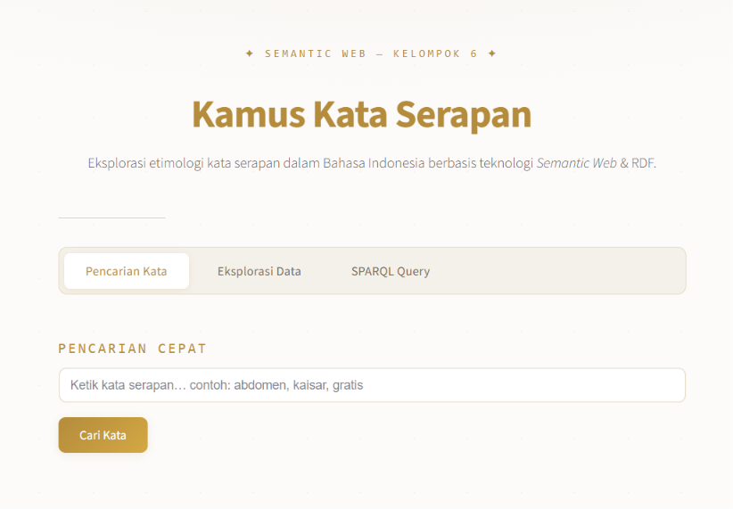
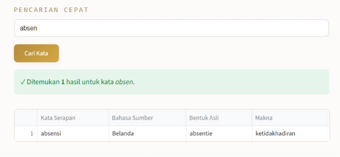
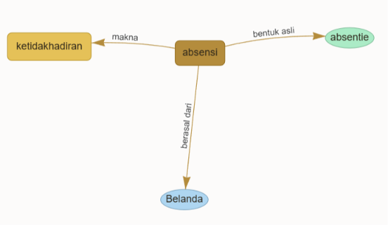
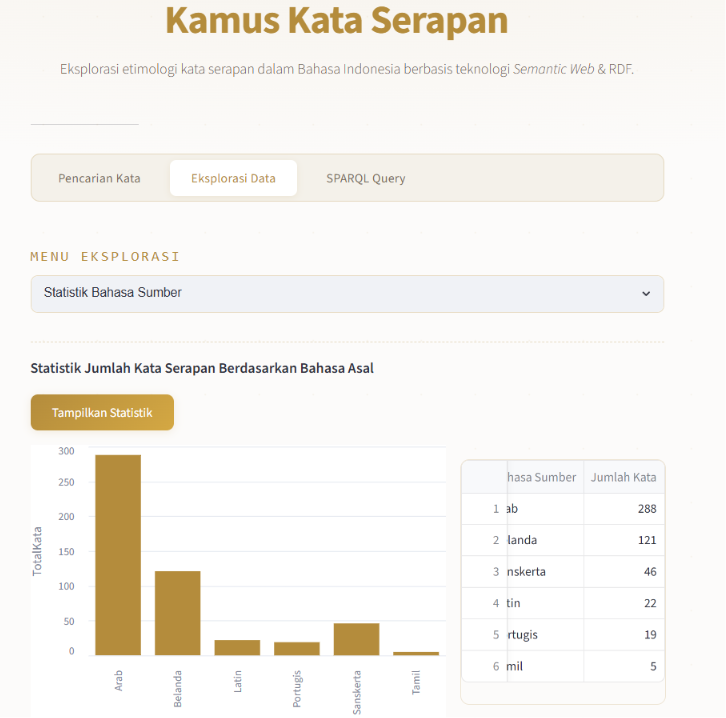
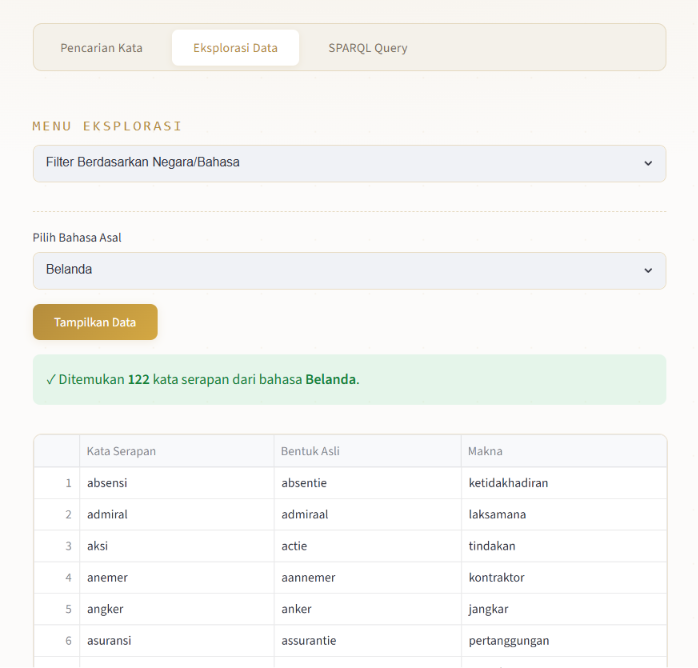
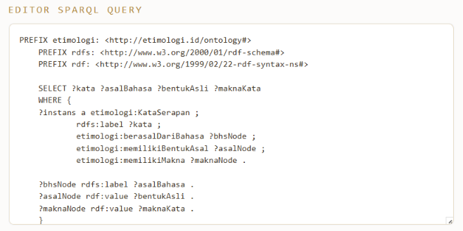
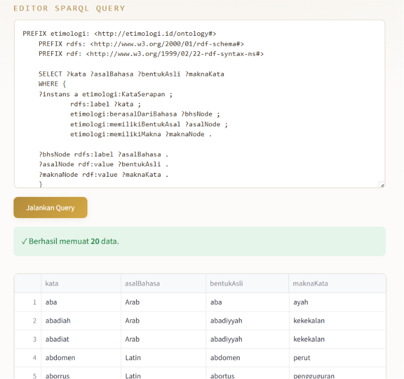

# 📖 Kamus Kata Serapan

Aplikasi pencarian etimologi kata serapan dalam Bahasa Indonesia, dibangun menggunakan teknologi Semantic Web (RDF/SPARQL) dengan Apache Jena Fuseki sebagai backend dan Streamlit sebagai antarmuka pengguna. Aplikasi ini juga menampilkan **Knowledge Graph interaktif** menggunakan PyVis untuk memvisualisasikan relasi antar entitas etimologi.

---

## 📑 Daftar Isi

- [Prasyarat Sistem](#prasyarat-sistem)
- [Panduan Instalasi](#panduan-instalasi)
- [Panduan Penggunaan](#panduan-penggunaan-aplikasi)
- [Contoh Hasil](#contoh-hasil)

---

## 🛠️ Prasyarat Sistem

Sebelum memulai, pastikan perangkat kamu sudah terinstal perangkat lunak berikut:

- **Python** (versi 3.8 atau lebih baru)
- **Java (JRE atau JDK)** — wajib terinstal karena Apache Jena Fuseki berjalan di atas Java
- **Git** — untuk mengunduh repositori proyek

---

## 🚀 Panduan Instalasi

### Langkah 1: Mengunduh Repositori Proyek (GitHub)

1. Buka Terminal atau Command Prompt (CMD).
2. Jalankan perintah berikut:
```bash
   git clone https://github.com/bun349/WebsiteSearch-KamusSerapan.git
```
3. Masuk ke direktori proyek:
```bash
   cd C:\ProyekSemweb-Kelompok6
```

### Langkah 2: Mengatur Lingkungan Python (Frontend)

Selanjutnya, kita akan menginstal semua library Python yang dibutuhkan oleh aplikasi Streamlit menggunakan file `requirements.txt`. Library inti yang digunakan: **Streamlit**, **SPARQLWrapper**, **Pandas**, dan **PyVis** (untuk visualisasi *knowledge graph*).

1. Pastikan kamu berada di dalam direktori folder proyek.
2. Buat virtual environment:

   **Windows:**
```bash
   python -m venv env
   env\Scripts\activate
```

   **Mac/Linux:**
```bash
   python3 -m venv env
   source env/bin/activate
```
3. Setelah virtual environment aktif (ditandai dengan tulisan `(env)` di terminal), jalankan:
```bash
   pip install -r requirements.txt
```

### Langkah 3: Menginstal & Menjalankan Apache Jena Fuseki (Backend)

1. Unduh Apache Jena Fuseki dari situs resmi Apache Jena (format `.zip`/`.tar.gz`).
2. Ekstrak ke folder pilihan kamu.
3. Buka Terminal/CMD baru, arahkan ke folder Fuseki yang diekstrak.
4. Jalankan server:

   **Windows:**
```bash
   fuseki-server.bat
```

   **Mac/Linux:**
```bash
   ./fuseki-server
```
5. Server berjalan di `http://localhost:3030`.

### Langkah 4: Konfigurasi Dataset di Fuseki

1. Akses `http://localhost:3030`, klik **Manage datasets** → **add new dataset**.
2. Ketik nama dataset persis: `kamus-serapan` (huruf kecil, pakai strip).
3. Pilih Dataset type **Persistent (TDB2)**.
4. Klik **create dataset**.

### Langkah 5: Mengunggah Data RDF ke Fuseki

1. Pada dataset `kamus-serapan`, klik **upload data** → **select files**.
2. Pilih file `.ttl`/`.rdf` dari folder proyek.
3. Klik **upload all** hingga muncul notifikasi sukses.

### Langkah 6: Menjalankan Aplikasi Streamlit

```bash
streamlit run app.py
```

Browser akan otomatis terbuka dan menampilkan aplikasi.

---

## 📋 Panduan Penggunaan Aplikasi

Checklist sebelum menggunakan aplikasi:

- [ ] **Unduh File Proyek (GitHub)** — termasuk file data RDF/ontologi (`.ttl`/`.rdf`).
- [ ] **Aktifkan Apache Jena Fuseki** — server backend aktif di lokal.
- [ ] **Siapkan Dataset** `kamus-serapan` dan data sudah di-*upload*.
- [ ] **Verifikasi Endpoint** — aplikasi otomatis terhubung ke `http://localhost:3030/kamus-serapan/query`.

> **Catatan:** Jika server Fuseki mati, nama dataset salah ketik, atau data belum diunggah, aplikasi menampilkan pesan **"Gagal terhubung ke SPARQL Endpoint. Pastikan Apache Jena Fuseki berjalan."**

Aplikasi memiliki tiga tab utama: **Pencarian Kata**, **Eksplorasi Data**, dan **SPARQL Query**.

### 🔎 Fitur 1: Pencarian Kata + Knowledge Graph (Tab "Pencarian Kata")

Fitur ini mencari etimologi suatu kata secara instan **dan** memvisualisasikannya dalam bentuk *graph* relasi antar entitas.

**Cara Penggunaan:**

1. Pada tab **Pencarian Kata**, isi kolom *"Ketik kata serapan… contoh: abdomen, kaisar, gratis"*.
2. Klik tombol **Cari Kata**.
   - Jika kolom kosong, muncul peringatan: **"⚠ Silakan masukkan kata kunci terlebih dahulu."**
3. Jika ditemukan, akan tampil:
   - Pesan sukses berisi jumlah hasil yang ditemukan.
   - Tabel dengan kolom **Kata Serapan**, **Bahasa Sumber**, **Bentuk Asli**, **Makna**.
   - **Knowledge Graph** interaktif di bawah tabel — menampilkan node *Kata Serapan* (kotak emas), *Bahasa Asal* (elips biru), *Bentuk Asli* (elips hijau), dan *Makna* (kotak kuning), saling terhubung dengan label relasi `berasal dari`, `bentuk asli`, dan `makna`.
4. Jika tidak ditemukan, muncul info: *"Tidak ada data ditemukan untuk kata '...'."*

> Graph dapat digeser, di-*zoom*, dan node-nya bisa ditarik (drag) untuk eksplorasi visual lebih lanjut.

### 📊 Fitur 2: Eksplorasi Data (Tab "Eksplorasi Data")

Tab ini berisi dua mode eksplorasi yang dipilih lewat *dropdown* **Menu Eksplorasi**:

**a) Statistik Bahasa Sumber**
1. Pilih opsi **"Statistik Bahasa Sumber"**.
2. Klik tombol **Tampilkan Statistik**.
3. Aplikasi menampilkan:
   - **Bar chart** (kolom kiri, lebih lebar) agregasi jumlah kata serapan per bahasa asal.
   - **Tabel rekapitulasi** (kolom kanan) dengan kolom **Bahasa Sumber** dan **Jumlah Kata**, diurutkan dari yang terbanyak.
   - Jika belum ada data: *"Belum ada data untuk ditampilkan."*

**b) Filter Berdasarkan Negara/Bahasa**
1. Pilih opsi **"Filter Berdasarkan Negara/Bahasa"**.
2. Pilih bahasa dari *dropdown*: **Belanda, Arab, Latin, Sanskerta, Portugis,** atau **Tamil**.
3. Klik tombol **Tampilkan Data**.
4. Hasil ditampilkan dalam tabel dengan kolom **Kata Serapan**, **Bentuk Asli**, dan **Makna** (kolom Bahasa Sumber tidak ditampilkan karena sudah jadi filter).
5. Jika tidak ada data: *"Tidak ada data kata serapan dari bahasa '...'."*

### 💻 Fitur 3: Eksekusi Manual (Tab "SPARQL Query")

Editor bebas untuk menjalankan *query* SPARQL kustom langsung ke endpoint Fuseki.

**Cara Penggunaan:**

1. Klik tab **SPARQL Query**.
2. Editor (*text area*) sudah otomatis terisi dengan **query default** yang mengambil 20 data pertama (kata, bahasa asal, bentuk asli, makna).
3. Anda bisa mengedit langsung *query* tersebut sesuai kebutuhan.
4. Klik tombol **Jalankan Query**.
5. Hasil:
   - Jika *query* kosong: peringatan **"⚠ Query tidak boleh kosong."**
   - Jika berhasil dan ada data: pesan sukses + tabel hasil (format Pandas DataFrame).
   - Jika *query* valid tapi tidak ada data cocok: **"Query berhasil dijalankan, tetapi tidak ada data yang cocok."**

---

## 🖼️ Contoh Hasil

### 1. Tampilan Awal Aplikasi



### 2. Pencarian Kata — Hasil Ditemukan + Knowledge Graph

Contoh pencarian kata `"absen"`:



| Kata Serapan | Bahasa Sumber | Bentuk Asli | Makna |
|---|---|---|---|
| absen | Belanda | absentie | tidak hadir |

Visualisasi *Knowledge Graph* yang muncul di bawah tabel:



### 3. Eksplorasi Data — Statistik Bahasa Sumber

Bar chart (kiri) dan tabel rekapitulasi (kanan):



| Bahasa Sumber | Jumlah Kata |
|---|---|
| Arab | 288 |
| Belanda | 121 |
| Sanskerta | 46 |
| Latin | 22 |
| Portugis | 19 |
| Tamil | 5 |

### 4. Eksplorasi Data — Filter Berdasarkan Bahasa

Contoh filter dengan bahasa `"Belanda"`:




### 5. Eksekusi Manual — Tab SPARQL Query

Editor dengan query default `LIMIT 20`:



```sparql
PREFIX etimologi: <http://etimologi.id/ontology#>
PREFIX rdfs: <http://www.w3.org/2000/01/rdf-schema#>
PREFIX rdf: <http://www.w3.org/1999/02/22-rdf-syntax-ns#>

SELECT ?kata ?asalBahasa ?bentukAsli ?maknaKata
WHERE {
  ?instans a etimologi:KataSerapan ;
           rdfs:label ?kata ;
           etimologi:berasalDariBahasa ?bhsNode ;
           etimologi:memilikiBentukAsal ?asalNode ;
           etimologi:memilikiMakna ?maknaNode .

  ?bhsNode rdfs:label ?asalBahasa .
  ?asalNode rdf:value ?bentukAsli .
  ?maknaNode rdf:value ?maknaKata .
}
LIMIT 20
```

### 6. Hasil Eksekusi Query SPARQL



---
